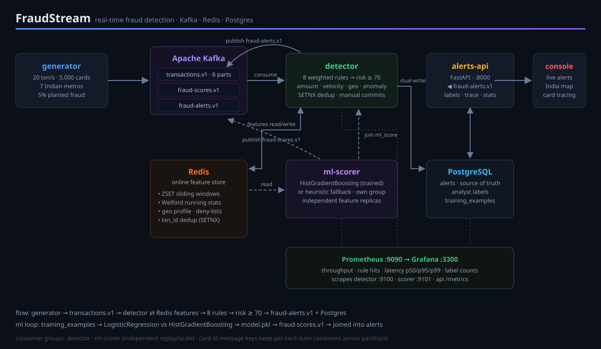

# FraudStream

**Real-time fraud detection on streaming payments, Kafka as the event backbone, Redis as an online feature store, a rules engine plus a trained ML model, and a live tracing console.**

A synthetic bank generates ~20 card transactions/sec across 5,000 cards in 7 Indian metros; ~5% are planted fraud (whale amounts, rapid bursts, impossible travel, blacklisted merchants). The pipeline evaluates every transaction in milliseconds, raises scored alerts, serves them on a live dashboard, and continuously trains its own ML model.



## Quickstart

```bash
docker compose up --build -d
```

Then open **http://localhost:8000/**, alerts start flowing within seconds.

| URL | What |
|---|---|
| **:8000** | Live tracing console, alert feed + analyst labeling, live India map, full transaction stream, per-card drill-down |
| :3300 | Grafana pipeline dashboards (throughput, rule hits, latency percentiles) |
| :9090 / :8080 | Prometheus · Kafka UI |

```bash
curl localhost:8000/alerts?limit=5        # recent alerts with risk score + ML score
docker compose logs -f detector           # watch detections stream
```

## Engineering highlights

The interesting parts, each maps to real code you can read.

### Kafka

| Technique | Where | Why it matters |
|---|---|---|
| Card-ID message keys → 6 partitions | `src/common/kafka_io.py` | All events for one card land on one partition, so per-card Redis state stays consistent across any number of detector replicas, no distributed locks |
| Independent consumer groups | `detector`, `ml-scorer` | Rules and ML scoring replay/scale independently over the same topic |
| Manual commits after processing | `src/detector/main.py` | Offsets advance only once a transaction is fully handled |
| Versioned topics (`transactions.v1`) | `src/common/config.py` | Schema evolution without breaking consumers |
| Offset resets for replay | ops workflow | Re-process any window of history at will |

### Redis

| Technique | Where | Why it matters |
|---|---|---|
| ZSET sliding windows | `detector/features.py` | Velocity limits (>N txns, >₹ sum) via timestamp-scored sorted sets pruned with `ZREMRANGEBYSCORE`, O(log n), no counters to decay by hand |
| Welford online algorithm | `detector/features.py` | Per-card spend mean/variance updated in O(1) per txn → statistical z-score anomaly detection without storing history |
| SETNX dedup gate | `detector/features.py::mark_processed` | At-least-once Kafka + idempotent processing = effectively-once feature updates across crashes |
| Geo profiles as HASHes | `detector/features.py` | Last-seen lat/lon per card → haversine implied-speed check between consecutive txns |
| Dual hot/cold storage | `alerts_api` | Hot reads from a time-ordered ZSET; durable truth in Postgres; automatic fallback |

### ML

| Stage | What happens |
|---|---|
| Archive | Detector writes every transaction's feature vector + rule verdict to Postgres (`training_examples`), weak supervision from the rules engine |
| Train | `python -m ml_scorer.train` → time-based split (train past, test future), LogisticRegression vs HistGradientBoosting showdown, winner by PR-AUC → versioned `model.pkl`. Latest run on ~267k rows: **precision 0.9998 · recall 0.988 · ROC-AUC 1.000** (13 features incl. geo velocity, personal z-score, cyclical hour-of-day) |
| Serve | `ml-scorer` auto-loads the artifact and maintains **independent replicas** of the stateful features (`mlvel:*`, `mlprofile:*`), no ordering race with the detector, NaN-safe features for cold-start cards |
| Join | Detector attaches `ml_score` to each alert, retroactively patching alerts that landed before their score did |

## Detection rules

Weighted scoring; risk ≥ 70 raises an alert.

| Rule | Signal | Weight |
|---|---|---|
| `amount_threshold` | txn > ₹1,00,000 | 75 |
| `velocity_count` | >5 txns / 5 min per card | 75 |
| `geo_velocity` | >900 km/h implied over ≥50 km displacement | 75 |
| `blacklist` | deny-listed card/merchant | 100 (instant) |
| `amount_anomaly` | >4σ above the card's personal spend mean (≥20 samples) | 55 |
| `velocity_sum` | >₹2,50,000 / 10 min per card | 40 |
| `user_velocity` | >12 txns / 10 min across all of a user's cards | 40 |
| `new_merchant` | first-ever merchant for this card | 15 |

All thresholds/weights live in `src/common/config.py`, env-overridable, no code changes.

## Reliability

- **Durable alerts**: dual-written to Postgres (source of truth) and a hot Redis ZSET; API degrades gracefully to Redis if PG is down.
- **Analyst labeling loop**: `POST /alerts/{id}/label` (`confirmed_fraud` / `false_positive`) from dashboard buttons, accumulating the human labels that will supersede rule-based weak supervision for training.
- **Crash safety**: dedup gate + manual commits mean restarts neither double-count velocity windows nor lose alerts.
- **Persistence**: Redis AOF + Postgres volume, full state survives restarts.

## Testing

```bash
pytest -q                        # everything, unit + live-stack integration
pytest -q -m "not integration"   # unit tests only, no Docker needed
ruff check src scripts tests     # lint
node tests/render_smoke.js       # executes the dashboard's JS against live payloads
```

Integration tests hit the real running stack (API health, Kafka consumer
heartbeat, Redis verdict records, Postgres sinks, Prometheus scrapes) and
**skip automatically** when it isn't running. Containerized Postgres is
published on host port **5433** to avoid clashing with a local instance.

## Running services locally (without Docker)

```bash
python -m venv .venv && .venv\Scripts\Activate.ps1   # Windows
pip install -r requirements.txt
$env:PYTHONPATH = "src"
python -u src/generator/main.py    # terminal 1
python -u src/detector/main.py     # terminal 2
uvicorn alerts_api.main:app --reload   # terminal 3
```

Kafka/Redis/Postgres must be reachable, defaults `localhost:9092`,
`localhost:6379`, `localhost:5432`; override via `KAFKA_BOOTSTRAP_SERVERS`,
`REDIS_URL`, `DATABASE_URL`. All thresholds live in `src/common/config.py`.

## Project layout

```
src/
├── common/        config · pydantic models · kafka io · pg pool · metrics
├── generator/     synthetic traffic with 4 planted fraud patterns
├── detector/      feature extraction · 8 rules · consume loop · dual writes
├── ml_scorer/     model abstraction · trainer · scoring service
└── alerts_api/    FastAPI · tracing endpoints · labeling · static console
monitoring/        prometheus config · grafana provisioning + dashboard
tests/             47 tests, rules · geometry · Welford math · model contract · live-stack integration
```

47 tests pass (`pytest -q`, unit + live-stack integration) plus
`node tests/render_smoke.js`, which executes the dashboard's actual JavaScript
against live API payloads. Lint is clean under `ruff check`.

## Stack

Kafka (KRaft) · Redis · PostgreSQL · Python 3.11 (confluent-kafka, FastAPI,
pydantic, scikit-learn, psycopg) · Docker Compose · Prometheus · Grafana ·
Leaflet · vanilla JS
